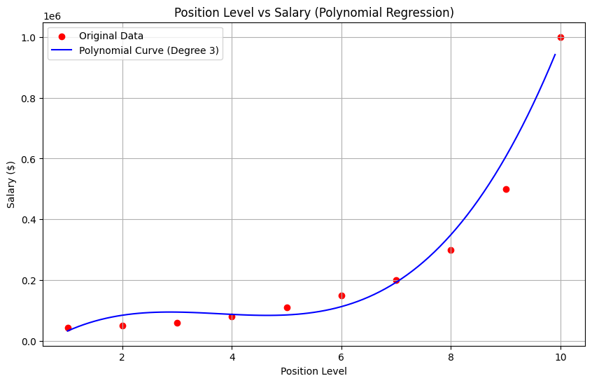

# Executive Salary Estimation Using Polynomial Regression

## Objective
The primary aim of this assignment is to construct a **Polynomial Regression (Degree = 3)** model to predict an employee's salary based on their position level. By capturing the non-linear relationship inherent in corporate compensation structures, this model provides a far more accurate salary estimate than standard linear baselines.

## Dataset Link
- [Position Salaries Dataset on Kaggle](https://www.kaggle.com/datasets/akram24/position-salaries)

## Libraries Used
- **Pandas**: Used for structured data loading, dataset inspection, and feature slicing.
- **NumPy**: Applied for mathematical arrays, grid generation, and numerical transformations.
- **Scikit-learn**: Employed for feature polynomial transformation (`PolynomialFeatures`), data splitting (`train_test_split`), model fitting (`LinearRegression`), and performance evaluation metrics.
- **Matplotlib**: Utilized for generating visual scatter plots and continuous regression curve plots.

## Methodology
1. **Data Exploration & Assessment**: Loaded the 10-row dataset to examine structural details, variable types (`Level` as $X$, `Salary` as $y$), and initial distribution summary stats.
2. **Data Preprocessing & Splitting**: Verified zero missing values across all entries. Configured the feature matrix into a 2D format and split the dataset into an 80% training set (8 samples) and a 20% testing set (2 samples) using `random_state=42`.
3. **Polynomial Feature Transformation & Modeling**: Enhanced the input feature by applying a degree-3 polynomial transformation. Trained an ordinary least squares regression model on the expanded feature matrix and generated predictions for the test split.
4. **Performance Evaluation & Visualization**: Calculated regression metrics (MAE, MSE, $R^2$) on test predictions. Rendered a continuous non-linear curve over the raw data points to visually analyze model fit.

## Results

### Regression Visualization

*Model Predictions vs Actuals (Test Set):*
- **Actual Values**: `[$50,000.00, $200,000.00]`
- **Predicted Values**: `[$53,230.77, $194,153.85]`

*Evaluated Performance Metrics:*
- **Mean Absolute Error (MAE)**: $4,538.46
- **Mean Squared Error (MSE)**: $22,366,863.91
- **$R^2$ Score**: 0.9960

### Key Observations
1. **Curved Wage Acceleration**: Salaries follow a distinct non-linear path, expanding exponentially at senior executive tiers (levels 8 to 10) rather than advancing uniformly.
2. **Superior Alignment**: Converting position levels into degree-3 polynomial space enables the line to follow the steep curve without underfitting mid-range titles, achieving an exceptional $R^2$ score of ~0.996.
3. **Linear Model Inadequacy**: A standard 1st-degree linear fit would dramatically underestimate executive compensation while overestimating entry-to-mid level roles.

## Conclusion
In this analysis, we modeled the relationship between employee position levels and their corresponding salaries. Key findings show that compensation grows exponentially rather than at a constant rate, particularly beyond mid-level roles. 

Unlike Simple Linear Regression, which fits a straight line ($y = mx + c$) and assumes a constant rate of change, Polynomial Regression models degree-based polynomial equations ($y = \beta_0 + \beta_1 x + \beta_2 x^2 + ... + \beta_n x^n$) to flexibly map non-linear curves. 

The primary advantage of Polynomial Regression for this dataset is its ability to accurately reflect non-linear wage structures without misrepresenting mid-level earnings or underestimating executive-level compensation.
